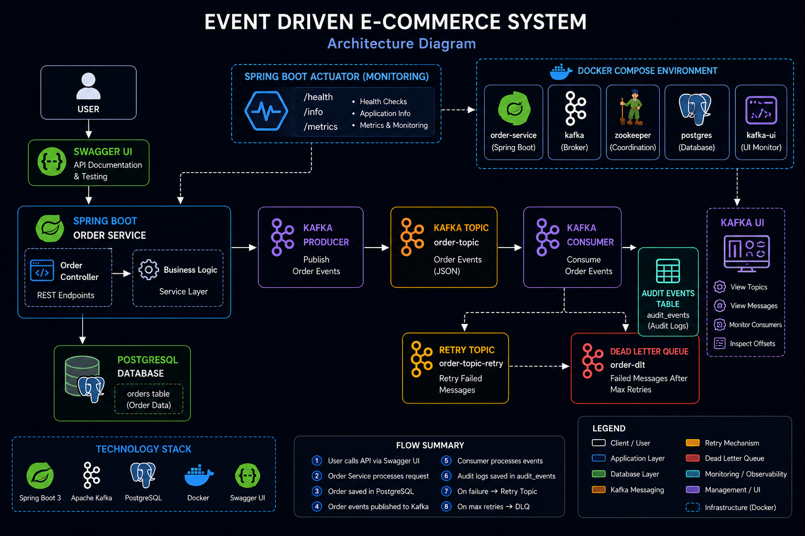
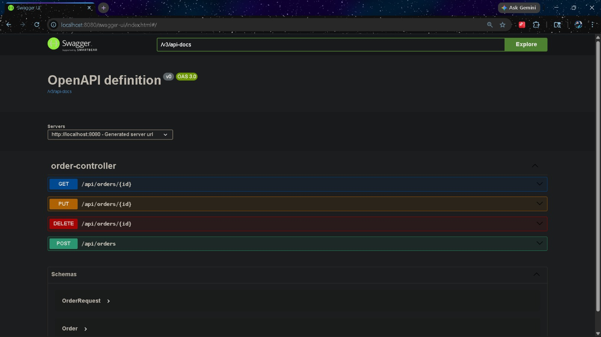
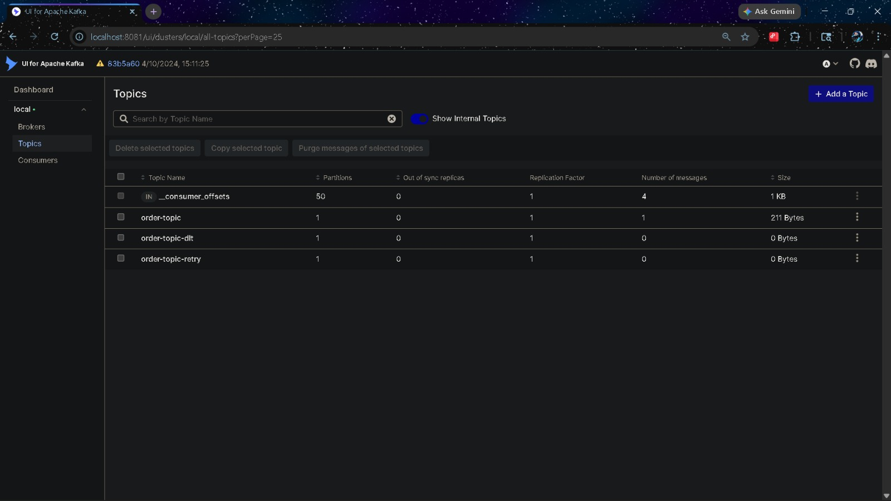
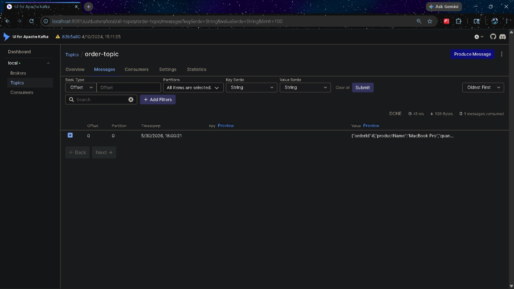
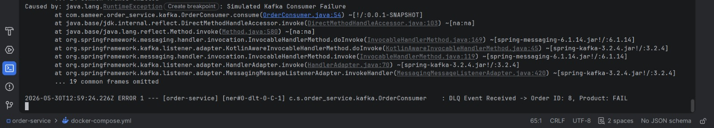
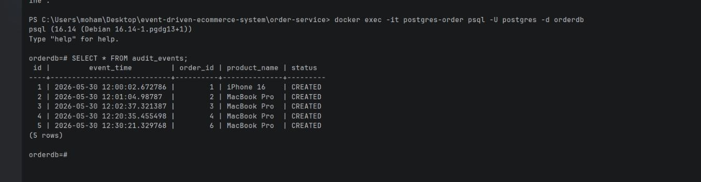
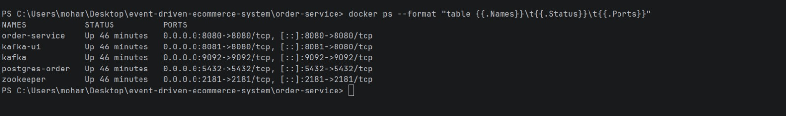
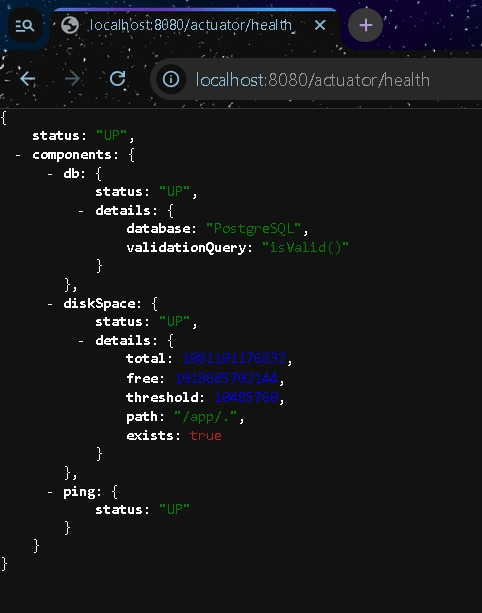

# Event-Driven E-Commerce System

## Overview

A production-style Event-Driven E-Commerce Backend built using Spring Boot, Apache Kafka, PostgreSQL, Docker, and Microservices principles.

This project demonstrates asynchronous communication between services using Kafka Events while ensuring reliability through Retry Mechanisms, Dead Letter Queues (DLQ), Audit Logging, Health Monitoring, and Dockerized deployment.

---

## Features

* Order Management (Create, Read, Update, Delete)
* Apache Kafka Producer & Consumer
* Event-Driven Architecture
* PostgreSQL Integration
* Audit Event Logging
* Kafka Retry Mechanism
* Dead Letter Queue (DLQ)
* Dockerized Infrastructure
* Swagger API Documentation
* Spring Boot Actuator Monitoring
* Kafka UI Monitoring Dashboard

---

## Architecture Diagram



---

## Tech Stack

| Technology      | Purpose              |
| --------------- | -------------------- |
| Java 21         | Programming Language |
| Spring Boot 3   | Backend Framework    |
| Spring Data JPA | Database Access      |
| PostgreSQL      | Relational Database  |
| Apache Kafka    | Event Streaming      |
| Docker          | Containerization     |
| Maven           | Build Tool           |
| Swagger OpenAPI | API Documentation    |
| Spring Actuator | Monitoring           |

---

## System Architecture

User → Swagger UI → Order Service → PostgreSQL

Order Service → Kafka Producer → order-topic

order-topic → Kafka Consumer → Audit Events Table

Failed Events → Retry Topic → Dead Letter Queue (DLQ)

Spring Actuator monitors application health and metrics.

---

## Screenshots

### Swagger UI



### Kafka Topics



### Kafka Message Flow



### Dead Letter Queue (DLQ)



### PostgreSQL Audit Logging



### Docker Containers Running



### Spring Actuator Health Check



---

## Kafka Event Flow

Order Created/Updated/Deleted

↓

Kafka Producer

↓

order-topic

↓

Kafka Consumer

↓

Audit Events Table

If processing fails:

order-topic

↓

order-topic-retry

↓

order-dlt

---

## API Endpoints

| Method | Endpoint         | Description  |
| ------ | ---------------- | ------------ |
| POST   | /api/orders      | Create Order |
| GET    | /api/orders/{id} | Get Order    |
| PUT    | /api/orders/{id} | Update Order |
| DELETE | /api/orders/{id} | Delete Order |

---

## Running the Project

### Clone Repository

```bash
git clone https://github.com/Sameer07-web/event-driven-ecommerce-system.git
```

### Build Project

```bash
mvn clean package
```

### Run Docker Containers

```bash
docker compose up --build
```

---

## Access Services

Swagger UI

```text
http://localhost:8080/swagger-ui/index.html
```

Kafka UI

```text
http://localhost:8081
```

Actuator Health

```text
http://localhost:8080/actuator/health
```

---

## Future Enhancements

* Inventory Service
* Payment Service
* Notification Service
* Redis Caching
* Kubernetes Deployment
* CI/CD Pipeline
* API Gateway
* Centralized Logging

---

## Author

Mohammad Sameer

GitHub: https://github.com/Sameer07-web

LinkedIn: https://linkedin.com/in/mohammadsameer007
